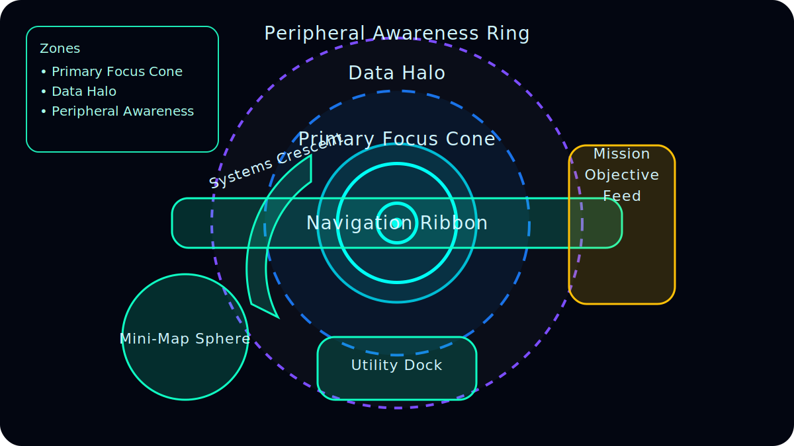

# Spaceship Heads-Up Display (HUD)

## Overview
The spaceship HUD provides real-time feedback to pilots by integrating navigation, combat, and systems data into a cohesive interface. It is designed for clarity during high-speed maneuvers and high-stress combat scenarios, ensuring mission-critical information is accessible without obstructing the pilot's view.

## Core Layout

*Figure 1. Visual map of the spaceship HUD showing viewport zones and key anchor panels.*

### Viewport Zones
- **Primary Focus Cone (Center 30%)**: The main field of view where the central reticle, weapon status, and target lock cues live.
- **Data Halo (Middle 40%)**: Semi-circular bands wrapping the focus cone to host critical health, shield, and power readouts without blocking the reticle.
- **Peripheral Awareness Ring (Outer 30%)**: Dimmer, high-opacity perimeter used for situational prompts such as off-screen enemy indicators and environmental hazards.

### Anchor Elements
- **Central Reticle**: Multi-layer reticle with dynamic ring segments to show weapon charge state and lead indicators for moving targets.
- **Navigation Ribbon**: Horizon-aligned ribbon stretching across the midline with pitch/roll ticks, velocity vector caret, and waypoint markers that color-shift based on proximity.
- **Mini-Map Sphere**: Lower-left translucent radar orb rendering relative object positions; expands subtly when multiple hostiles are nearby to emphasize priority contacts.

### Supporting Panels
- **Systems Crescent (Left)**: Curved panel hugging the reticle that visualizes shield strength, hull integrity, and capacitor charge via segmented gauges.
- **Mission Objective Feed (Right)**: Vertical ticker presenting current objectives, timers, and priority alerts with icons for mission type (defend, escort, recon, etc.).
- **Utility Dock (Bottom Center)**: Modular slots displaying consumables, cooldown timers, and countermeasure readiness, arranged to align with the pilot's natural down-glance.

## Key Elements
### Combat Indicators
- Weapon heat gauges with overheat warnings.
- Missile lock status and countermeasure readiness.
- Target ID cards with distance, velocity, and threat level.

### Navigation & Flight Data
- Speedometer displaying current speed, velocity vector, and afterburner state.
- Altitude/depth readout relative to key celestial bodies or structures.
- Jump-drive charge indicator and countdown when engaged.

### System Diagnostics
- Shield segments with color-coded damage visualization.
- Power distribution sliders for engines, shields, and weapons.
- Damage alerts highlighting affected ship modules.

## Interaction & UX Considerations
- **Color Coding**: Friendly data in cyan, warnings in amber, critical alerts in red.
- **Transparency**: Adaptive opacity ensures visibility of space while keeping HUD readable.
- **Modularity**: Panels can be reconfigured for specialized roles (e.g., navigator, gunner).
- **Accessibility**: Optional audio cues and haptic feedback for critical states.

## Implementation Notes
- Utilize vector graphics for sharp rendering at variable resolutions.
- Support shader-based glow and bloom effects for futuristic styling.
- Provide customization hooks for localization and unit conversions.
- Ensure performance by batching UI draw calls and minimizing overdraw.

## Future Enhancements
- Integrate AI copilot suggestions within mission feed.
- Add customizable widgets for player preferences.
- Implement replay/recording overlay toggles for mission analysis.

